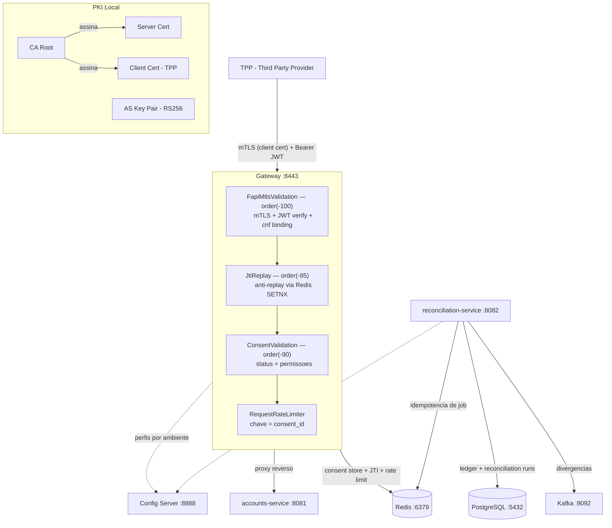

# Open Finance

Plataforma de servicos Open Finance Brasil composta por um API Gateway FAPI 1.0 Advanced (mTLS,
certificate-bound access tokens, JTI replay prevention, validacao de consentimentos e rate limiting)
e um servico de reconciliacao financeira que compara transacoes do ledger interno com arquivos CNAB240
da CIP via Spring Batch.

[](https://github.com/mcoldibelli/open-finance/actions/workflows/ci.yml)
[](https://github.com/mcoldibelli/open-finance/actions/workflows/cd.yml)


---

## Modulos

| Modulo                    | Porta | Responsabilidade                                                                                |
|---------------------------|-------|-------------------------------------------------------------------------------------------------|
| **config-server**         | 8888  | Servidor de configuracao centralizado (Spring Cloud Config, perfil `native`)                    |
| **gateway-service**       | 8443  | API Gateway FAPI 1.0 Advanced — mTLS, JWT, cnf binding, consent, rate limiting                 |
| **accounts-service**      | 8081  | Stub de contas Open Banking (`/open-banking/accounts/v2`) — dados mock para testes do gateway   |
| **reconciliation-service**| 8082  | Reconciliacao financeira CIP/CNAB240 via Spring Batch ([README proprio](reconciliation-service/README.md)) |

---

## Arquitetura



O Gateway e o unico ponto de entrada para o Open Finance. Nenhum servico interno aceita trafego
externo. O TPP (instituicao participante do Open Finance) precisa apresentar certificado de cliente
via mTLS e um JWT assinado pelo Authorization Server para que a request passe pela cadeia de filtros.

O reconciliation-service opera de forma independente, processando arquivos CNAB240 da CIP e
publicando divergencias no Kafka. Detalhes de design do batch em
[reconciliation-service/README.md](reconciliation-service/README.md).

---

## Stack e justificativas

| Tecnologia               | Papel                         | Por que essa escolha                                                                                                 |
|--------------------------|-------------------------------|----------------------------------------------------------------------------------------------------------------------|
| **Java 21**              | Runtime                       | Records para modelos imutaveis, LTS                                                                                  |
| **Spring Cloud Gateway** | API Gateway                   | Reativo (Project Reactor), integracao nativa com filtros ordenados e `SslInfo` para acesso ao certificado do cliente |
| **Spring Cloud Config**  | Configuracao centralizada     | Perfis por ambiente (`local`, `docker`), sem rebuild — rotas e rate limits podem mudar sem redeploy                  |
| **Redis**                | Rate limiting + consent + JTI | TTL nativo para expiracao de consentimentos e JTI replay, operacoes atomicas via Lua script, Lettuce (non-blocking)  |
| **Nimbus JOSE+JWT**      | Processamento JWT             | Implementacao de referencia para JOSE/JWT, suporte a RS256 e claims customizadas (`cnf`, `consent_id`)               |
| **Spring Batch 5**       | Reconciliacao em batch        | Chunk-oriented processing, particionamento nativo por ISPB, restart/retry, listeners para auditoria                  |
| **Spring Data JPA**      | Persistencia                  | Abstracao sobre Hibernate, batch insert com `hibernate.jdbc.batch_size=500` e `order_inserts=true`                   |
| **PostgreSQL 16**        | Banco de dados                | ACID, `NUMERIC(15,2)` para valores monetarios, Flyway para migracoes versionadas                                    |
| **Apache Kafka 3.7**     | Mensageria assincrona         | Pub/sub para divergencias de reconciliacao, ordering por `endToEndId` (partition key)                                |
| **Bouncy Castle**        | Certificados de teste         | Geracao programatica de KeyPair e X.509 em memoria — testes reproduziveis sem arquivos externos                      |
| **Testcontainers**       | Infra de teste                | Redis, PostgreSQL e Kafka reais em containers efemeros, sem dependencia de infra local                               |
| **Docker**               | Containerizacao               | Multi-stage build (JDK -> JRE), imagem Alpine, usuario non-root                                                     |
| **GitHub Actions**       | CI/CD                         | Build e testes automaticos, push para GHCR, pipeline staging -> prod                                                 |

---

## Decisoes de design

### Pipeline de filtros e ordem de execucao

Os filtros do Gateway executam por ordem definida via `getOrder()`:

| Filtro                     | Order   | Responsabilidade                                           |
|----------------------------|---------|------------------------------------------------------------|
| `FapiMtlsValidationFilter` | -100    | Identidade: valida certificado + JWT + cnf binding         |
| `JtiReplayFilter`          | -95     | Anti-replay: rejeita JTI ja utilizado (Redis SETNX + TTL)  |
| `ConsentValidationFilter`  | -90     | Autorizacao: verifica status e permissoes do consentimento |
| `RequestRateLimiter`       | default | Throttling: limita requests por `consent_id`               |

A ordem importa: se o rate limiter rodasse primeiro, um atacante sem certificado consumiria a cota
de rate limit de outros TPPs. Autenticacao deve sempre preceder controle de trafego. Alem disso, o
`consent_id` usado como chave do rate limiter so existe apos o `FapiMtlsValidationFilter` extrai-lo
do JWT e injeta-lo no header `X-Consent-ID`.

### Headers injetados pelo FapiMtlsValidationFilter

Apos validar o JWT, o filtro mTLS injeta headers no request mutado para consumo pelos filtros
seguintes e pelo servico downstream:

| Header                  | Fonte                                | Consumidor                      |
|-------------------------|--------------------------------------|---------------------------------|
| `X-Consent-ID`         | claim `consent_id` do JWT            | ConsentValidationFilter         |
| `X-Caller-CPF`         | claim `cpf` do JWT                   | Servico downstream              |
| `X-Client-ID`          | claim `client_id` do JWT             | Servico downstream              |
| `X-FAPI-Interaction-ID`| Header do client ou UUID gerado      | Rastreamento FAPI               |
| `X-Token-Jti`          | claim `jti` do JWT                   | JtiReplayFilter                 |
| `X-Token-Exp`          | claim `exp` do JWT (epoch seconds)   | JtiReplayFilter                 |
| `X-Cert-Thumbprint`    | SHA-256 do certificado apresentado   | Servico downstream              |

O `X-FAPI-Interaction-ID` preserva o valor enviado pelo client (correlation ID conforme spec FAPI).
Se ausente, um UUID e gerado. O `X-Token-Jti` e um header separado que carrega o JWT ID para o
filtro de replay — semanticamente distinto do interaction ID.

### cnf binding (RFC 8705) — o ataque que previne

Sem certificate-bound tokens, um JWT roubado pode ser usado por qualquer cliente. O cnf binding
resolve isso:

1. O Authorization Server gera o JWT com a claim `cnf.x5t#S256` = SHA-256 do certificado do TPP
2. O Gateway computa o SHA-256 do certificado apresentado via mTLS (
   `CertificateThumbprint.computeS256`)
3. Se o thumbprint do JWT for diferente do thumbprint do certificado, a request e rejeitada

A validacao do thumbprint binding e **incondicional** — acontece independentemente do modo SSL estar
ativo ou nao. Isso previne que uma desabilitacao acidental do SSL em producao neutralize a validacao
de seguranca silenciosamente.

### JTI replay prevention

O `JtiReplayFilter` usa `SETNX` atomico no Redis com TTL igual ao tempo restante de vida do JWT:

```java
redisTemplate.opsForValue()
    .setIfAbsent("jti:" + jti, "1", Duration.ofSeconds(ttl))
```

- Primeiro uso: Redis registra o JTI com TTL → request passa
- Replay: chave ja existe → 401 "Token already used"
- TTL expira junto com o JWT → memoria do Redis e liberada automaticamente

Se o Redis estiver indisponivel, o filtro retorna **503 Service Unavailable** (fail-closed). A
decisao de fail-closed e intencional: em um contexto FAPI, permitir replay por falha de infra e mais
danoso do que rejeitar temporariamente requests legitimas.

### JwtVerifier imutavel

O `JwtVerifier` recebe `RSASSAVerifier` via construtor — sem `setPublicKey()`, sem `@PostConstruct`.

```
Producao                             Testes
JwtConfig.java                       TestJwtConfig.java
@ConditionalOnResource(as-public.pem)   @TestConfiguration
  └─ @Bean RSASSAVerifier               └─ @Bean RSASSAVerifier
       (carrega PEM do classpath)             (chave gerada em memoria)
          │                                        │
          └──────────┐            ┌────────────────┘
                     ▼            ▼
               JwtVerifier(RSASSAVerifier verifier)
```

`JwtConfig` so e carregada quando `classpath:as-public.pem` existe (`@ConditionalOnResource`). Nos
testes, o `TestJwtConfig` fornece o bean com a chave publica gerada pelo `CertificateGenerator`.

### Tratamento de erros no pipeline reativo

```java
jwtVerifier.verify(token.get())
    .onErrorMap(e -> !(e instanceof SecurityException),
        e -> new SecurityException("Invalid token: " + e.getMessage()))
    .flatMap(claims -> processValidatedClaims(...))
    .onErrorResume(SecurityException.class, e -> reject(...));
```

Um unico `onErrorMap` com predicado converte qualquer excecao non-Security (ex: `ParseException` do
Nimbus) em `SecurityException`, preservando as que ja sao Security. Isso garante que o
`onErrorResume` final captura **todos** os erros de validacao, sem vazar stack traces internos como
500.

Mensagens de erro de seguranca sao **genericas** no header de resposta (`Invalid token issuer`) —
detalhes como o issuer/audience real do token sao logados a nivel WARN, nunca expostos ao cliente.

### Config Server vs application.yml local

```
application.yml (local)          Config Server (gateway-service.yml)
├── spring.config.import         ├── server.port
├── server.ssl.*                 ├── spring.data.redis.*
│   ├── key-store                ├── spring.cloud.gateway.routes
│   ├── trust-store              ├── gateway.rate-limit.*
│   └── client-auth: need        └── jwt.issuer / jwt.audience
└── spring.cloud.config.retry
```

**Regra**: o SSL vai no `application.yml` local porque o servidor precisa do keystore/truststore
para iniciar o listener TLS **antes** de conectar ao Config Server. Se o SSL dependesse do Config
Server, o Gateway nao conseguiria sequer fazer a request HTTP para buscar a config.

### `Mono.defer()` no `reject()`

```java
private Mono<Void> reject(ServerWebExchange exchange, String reason) {
  return Mono.defer(() -> {
    exchange.getResponse().setStatusCode(HttpStatus.UNAUTHORIZED);
    exchange.getResponse().getHeaders().add("X-Rejection-Reason", reason);
    return exchange.getResponse().setComplete();
  });
}
```

Sem `Mono.defer()`, o `setStatusCode` e `addHeader` seriam executados **no momento da montagem do
pipeline**, nao na subscricao. O `defer()` garante que os side-effects so ocorrem quando o `Mono` e
de fato executado.

### Por que o AS assina o JWT e nao o TPP

No modelo FAPI (e OAuth 2.0 em geral), o fluxo e:

1. TPP se autentica no Authorization Server via mTLS
2. AS valida o consentimento e emite um JWT **assinado com a chave privada do AS**
3. Gateway valida a assinatura com a **chave publica do AS** (`as-public.pem`)

Se o TPP assinasse o JWT, nao haveria como garantir que ele nao forjou claims (`consent_id`, `cpf`,
permissoes). O AS e a unica entidade que pode atestar que o consentimento existe e esta autorizado.

### Usuario non-root nos Dockerfiles

```dockerfile
RUN addgroup -S spring && adduser -S spring -G spring
USER spring
```

Todo Dockerfile cria um usuario `spring` e roda o processo Java como esse usuario. Se um atacante
explorar uma vulnerabilidade na aplicacao, ele tera permissoes limitadas dentro do container.

---

## Como rodar localmente

### Pre-requisitos

- Java 21
- Docker e Docker Compose
- OpenSSL e keytool (apenas para execucao com mTLS real)

### 1. Gerar PKI local (para execucao com Docker Compose)

```bash
mkdir -p certs && cd certs

# CA root
openssl genrsa -out ca.key 2048
openssl req -new -x509 -days 365 -key ca.key -out ca.crt \
  -subj "/CN=Open Finance CA/O=Codaline/C=BR"

# Certificado do servidor (Gateway)
openssl genrsa -out server.key 2048
openssl req -new -key server.key -out server.csr \
  -subj "/CN=localhost/O=Codaline/C=BR"
openssl x509 -req -days 365 -in server.csr \
  -CA ca.crt -CAkey ca.key -CAcreateserial -out server.crt
openssl pkcs12 -export -in server.crt -inkey server.key \
  -out server.p12 -name gateway -passout pass:gateway123

# Certificado do cliente (TPP simulado)
openssl genrsa -out client.key 2048
openssl req -new -key client.key -out client.csr \
  -subj "/CN=tpp-simulado/O=TPP/C=BR"
openssl x509 -req -days 365 -in client.csr \
  -CA ca.crt -CAkey ca.key -CAcreateserial -out client.crt

# Truststore (contem o CA)
keytool -import -file ca.crt -alias ca-root \
  -keystore truststore.p12 -storetype PKCS12 \
  -storepass truststore123 -noprompt

# Par de chaves do Authorization Server
openssl genrsa -out as-private.key 2048
openssl rsa -in as-private.key -pubout -out as-public.pem

# Copiar chave publica para o classpath do Gateway
cp as-public.pem ../gateway-service/src/main/resources/
```

### 2. Configurar `.env`

```dotenv
REDIS_PASSWORD=openfinance123
POSTGRES_PASSWORD=reconciliation123
SSL_KEYSTORE_PASSWORD=gateway123
SSL_TRUSTSTORE_PASSWORD=truststore123
SSL_KEYSTORE_PATH=/absolute/path/to/certs/server.p12
SSL_TRUSTSTORE_PATH=/absolute/path/to/certs/truststore.p12
CERTS_DIR=/absolute/path/to/certs
```

### 3. Subir os servicos

```bash
docker compose up --build
```

Servicos do compose: Redis, PostgreSQL, Kafka (KRaft), Config Server, Gateway, Accounts e
Reconciliation. Health checks garantem a ordem de inicializacao.

---

## Testes

Os testes de integracao **nao dependem de arquivos externos**. Certificados e chaves sao gerados
programaticamente em memoria via Bouncy Castle, e toda a infraestrutura (Redis, PostgreSQL, Kafka)
roda em containers efemeros via Testcontainers.

```bash
# Nenhuma variavel de ambiente necessaria
./mvnw verify
```

### Infraestrutura de teste

| Componente            | Gateway                                                  | Reconciliation                                           |
|-----------------------|----------------------------------------------------------|----------------------------------------------------------|
| **Certificados**      | `CertificateGenerator` gera KeyPair RSA e X.509          | —                                                        |
| **Chave publica AS**  | `TestJwtConfig` injeta `RSASSAVerifier` com chave gerada | —                                                        |
| **Redis**             | Testcontainers `redis:7.2-alpine` com porta dinamica     | —                                                        |
| **PostgreSQL**        | —                                                        | Testcontainers `postgres:16-alpine`                      |
| **Kafka**             | —                                                        | Testcontainers `confluentinc/cp-kafka:7.6.0`             |
| **SSL**               | Desabilitado — thumbprint via header                     | —                                                        |
| **Config Server**     | Desabilitado — rotas via `@TestPropertySource`           | Desabilitado — datasource via `@DynamicPropertySource`   |

### O que cada teste valida

#### Gateway — FapiConsentFilterTest (8 testes)

| Teste                                                        | Cenario                                         | Resposta |
|--------------------------------------------------------------|-------------------------------------------------|----------|
| `dado_semToken_quando_request_entao_retorna401`              | Request sem header Authorization                | 401      |
| `dado_tokenSemCnf_quando_request_entao_retorna401`          | JWT valido mas sem claim `cnf.x5t#S256`         | 401      |
| `dado_tokenValido_quando_consentimentoAutorizado_entao_passa`| JWT + consent AUTHORISED + permissao correta    | 200/502  |
| `dado_semPermissao_quando_acessaTransacoes_entao_retorna403` | Consent sem `ACCOUNTS_TRANSACTIONS_READ`        | 403      |
| `dado_consentimentoInexistente_quando_request_entao_retorna401`| consent_id nao existe no Redis                | 401      |
| `dado_tokenExpirado_quando_request_entao_retorna401`         | JWT com `exp` no passado                        | 401      |
| `dado_assinaturaInvalida_quando_request_entao_retorna401`    | JWT assinado com chave diferente do AS          | 401      |
| `dado_consentimentoRevogado_quando_request_entao_retorna403` | Consent com status REVOKED                      | 403      |

#### Gateway — JtiReplayFilterTest (2 testes)

| Teste                                                        | Cenario                                         | Resposta |
|--------------------------------------------------------------|-------------------------------------------------|----------|
| `dado_mesmoToken_quando_replayAttack_entao_retorna401`       | Mesmo JWT enviado 2x — segundo uso rejeitado    | 401      |
| `dado_tokensDistintos_quando_requests_entao_ambosPassam`     | JTIs diferentes passam independentemente         | 200/502  |

#### Reconciliation — testes unitarios e integracao

| Classe                             | Tipo       | O que valida                                                                           |
|------------------------------------|------------|----------------------------------------------------------------------------------------|
| `CipFileReaderTest`                | Unitario   | Parsing CNAB240: campos posicionais, conversao centavos, header ignorado               |
| `CipTransactionFieldSetMapperTest` | Unitario   | Validacao do campo `amount`: numerico, rejeicao de invalidos, `movePointLeft(2)`       |
| `ReconciliationJobIntegrationTest` | Integracao | Fluxo completo: CNAB -> reconciliacao com ledger -> persistencia -> contadores no run  |

---

## Pipeline CI/CD

```
push (qualquer branch)
  └─ CI: build + testes
       ├─ Setup Java 21
       ├─ ./mvnw verify (Testcontainers sobe Redis, PostgreSQL e Kafka)
       └─ Upload de relatorios Surefire

push (main)
  └─ CD: build images + deploy
       ├─ Build multi-stage (Dockerfile por modulo)
       ├─ Push para GHCR (ghcr.io/mcoldibelli/open-finance/*)
       │   ├─ config-server:latest + :sha
       │   ├─ gateway-service:latest + :sha
       │   ├─ accounts-service:latest + :sha
       │   └─ reconciliation-service:latest + :sha
       ├─ Deploy staging (environment gate)
       └─ Deploy production
```

O CI nao precisa gerar certificados nem configurar variaveis de ambiente — toda a infraestrutura
criptografica e criada em memoria pelo Bouncy Castle durante a execucao dos testes.

---
