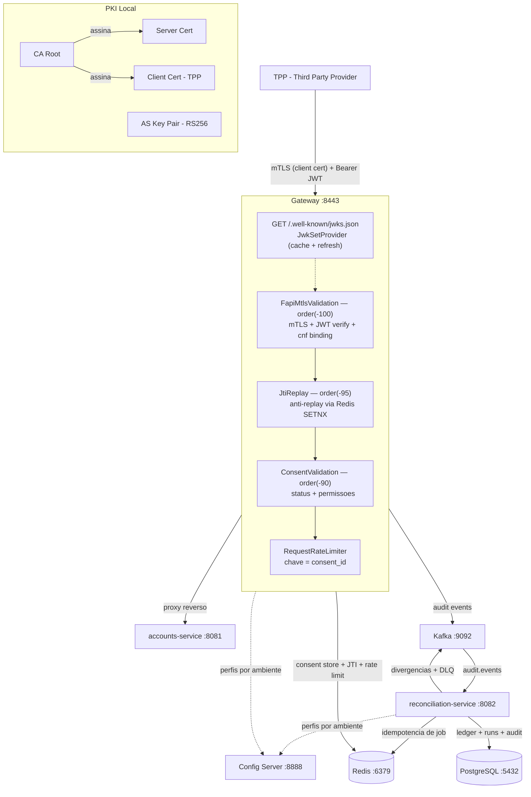

# Open Finance

API Gateway FAPI 1.0 Advanced para Open Finance Brasil + servico de reconciliacao CIP/CNAB240.

O gateway implementa mTLS com certificate-bound tokens (RFC 8705), JWKS com rotacao de chaves,
JTI replay prevention, validacao de consentimentos e rate limiting. A reconciliacao processa
arquivos posicionais da CIP via Spring Batch. Tudo auditado em topico Kafka conforme BACEN 4.658.

[](https://github.com/mcoldibelli/open-finance/actions/workflows/ci.yml)
[](https://github.com/mcoldibelli/open-finance/actions/workflows/cd.yml)


## Modulos

| Modulo                     | Porta | Descricao                                             |
|----------------------------|-------|-------------------------------------------------------|
| `config-server`            | 8888  | Spring Cloud Config (perfil `native`)                 |
| `gateway-service`          | 8443  | Gateway FAPI — mTLS, JWT, consent, rate limiting      |
| `accounts-service`         | 8081  | Stub Open Banking para testes do gateway              |
| `reconciliation-service`   | 8082  | Reconciliacao CIP/CNAB240 ([README](reconciliation-service/README.md)) |

## Arquitetura



O Gateway e o unico ponto de entrada. O TPP apresenta certificado cliente via mTLS e um JWT
assinado pelo Authorization Server. A request so chega ao servico downstream se passar por todos
os filtros.

O reconciliation-service opera independente — processa CNAB240 da CIP e publica divergencias no
Kafka. Detalhes em [reconciliation-service/README.md](reconciliation-service/README.md).

## Stack

Java 21, Spring Cloud Gateway (reativo, `SslInfo` para acesso ao cert do cliente), Spring Cloud
Config (perfis por ambiente sem rebuild), Redis (consent store + JTI replay via SETNX + rate
limiting via Lua script), Nimbus JOSE+JWT (RS256, claims `cnf`/`consent_id`), Spring Batch 5
(chunk processing, restart/retry por step), PostgreSQL 16 (Flyway, `NUMERIC(15,2)` para valores
monetarios), Kafka 3.7 (divergencias + DLQ + audit trail com 90 dias de retencao), Testcontainers
(Redis/PostgreSQL/Kafka reais em testes sem dependencia de infra local), Docker (multi-stage
JDK->JRE, Alpine, non-root).

## Decisoes de design

### Ordem dos filtros

| Filtro                     | Order   | Papel                                              |
|----------------------------|---------|----------------------------------------------------|
| `FapiMtlsValidationFilter` | -100    | Valida certificado + JWT + cnf binding              |
| `JtiReplayFilter`          | -95     | Rejeita JTI repetido (Redis SETNX + TTL)           |
| `ConsentValidationFilter`  | -90     | Verifica status e permissoes do consentimento       |
| `RequestRateLimiter`       | default | Rate limit por `consent_id`                         |

A ordem importa: se o rate limiter rodasse antes da autenticacao, um atacante sem certificado
consumiria a cota de rate limit de outros TPPs. Alem disso, o `consent_id` usado como chave do
rate limiter so existe apos o `FapiMtlsValidationFilter` extrair do JWT e injetar no header
`X-Consent-ID`.

Apos validacao, o filtro mTLS injeta headers no request mutado (`X-Consent-ID`, `X-Caller-CPF`,
`X-Client-ID`, `X-FAPI-Interaction-ID`, `X-Token-Jti`, `X-Token-Exp`, `X-Cert-Thumbprint`) para
consumo pelos filtros subsequentes e pelo servico downstream.

### cnf binding (RFC 8705)

Sem certificate-bound tokens, um JWT roubado pode ser usado por qualquer cliente. O cnf binding
resolve: o AS gera o JWT com `cnf.x5t#S256` = SHA-256 do certificado do TPP, e o gateway compara
com o SHA-256 do certificado apresentado via mTLS. Se forem diferentes, rejeita.

A validacao e incondicional — funciona mesmo com SSL desabilitado. Isso evita que uma
desabilitacao acidental em producao neutralize a validacao silenciosamente.

### JTI replay prevention

`JtiReplayFilter` usa `SETNX` atomico no Redis com TTL = tempo restante do JWT. Primeiro uso
registra e passa; segundo uso encontra a chave e retorna 401. TTL expira junto com o token, sem
acumulo de lixo no Redis.

Se o Redis estiver fora, retorna 503 (fail-closed). Em contexto FAPI, permitir replay por falha
de infra e pior do que rejeitar requests temporariamente.

### JWKS e rotacao de chaves (RFC 7517)

`JwkSetProvider` implementa cache com TTL configuravel e refresh-on-miss. Se o `kid` do token nao
esta no cache, o provider busca o JWKS novamente antes de rejeitar — grace period para rotacao.

```
Producao                              Testes
FapiSecurityConfig                    IntegrationTestBase.TestSecurityConfig
  └─ JwkSetProvider(url, ttl)            └─ JwkSetProvider.withPreloadedKeys(jwkSet)
       (fetch HTTP + cache)                   (chaves RSA em memoria)
          │                                        │
          └──────────┐            ┌────────────────┘
                     ▼            ▼
            JwtVerifier(JwkSetProvider provider)
```

### Audit trail (BACEN 4.658)

Eventos de seguranca (mTLS, JTI, consent) e do batch (job started/completed/failed) sao
publicados no topico `audit.events` (retencao 90 dias) e persistidos em tabela append-only no
PostgreSQL. A tabela usa trigger que bloqueia UPDATE/DELETE — imutabilidade garantida no banco,
nao na aplicacao.

### SSL no application.yml, rotas no Config Server

O SSL vai no `application.yml` local porque o servidor precisa do keystore para iniciar o listener
TLS **antes** de conectar ao Config Server. Rotas, rate limits e conexoes Redis/Kafka ficam no
Config Server (podem mudar sem redeploy).

## Como rodar

### Pre-requisitos

- Java 21, Docker
- Python 3 + `pyjwt` + `cryptography` (so para o smoke test)

### 1. Gerar PKI

```bash
bash tools/setup-pki.sh
```

Le senhas do `.env`, gera CA + server cert + client cert + truststore + chaves JWT no diretorio
`CERTS_DIR`. Idempotente — nao regera se ja existem.

### 2. Configurar `.env`

```dotenv
REDIS_PASSWORD=<senha>
POSTGRES_PASSWORD=<senha>
SSL_KEYSTORE_PASSWORD=<senha>
SSL_TRUSTSTORE_PASSWORD=<senha>
SSL_KEYSTORE_PATH=/caminho/absoluto/certs/server.p12
SSL_TRUSTSTORE_PATH=/caminho/absoluto/certs/truststore.p12
CERTS_DIR=/caminho/absoluto/certs
```

### 3. Subir

```bash
docker compose up --build
```

Health checks garantem a ordem de inicializacao.

## Testes

```bash
./mvnw verify
```

Nao precisa de `.env`, certificados ou infra rodando. Tudo e gerado em memoria (Bouncy Castle para
certs, Testcontainers para Redis/PostgreSQL/Kafka). SSL fica desabilitado nos testes — thumbprint
validado via header.

### Smoke test (E2E com mTLS)

```bash
pip install pyjwt cryptography   # uma vez
bash tools/smoke-test.sh
```

Gera PKI, sobe infra Docker, inicia o gateway local com `client-auth: need` e roda 14 testes:

- **mTLS** — sem cert e cert nao-confiavel sao rejeitados no handshake TLS
- **JWT/JWKS** — token ausente, expirado, kid desconhecido, sem `cnf` retornam 401
- **cnf binding** — thumbprint do cert != `cnf.x5t#S256` retorna 401
- **Consent** — AUTHORISED passa, REVOKED da 403, inexistente da 401
- **JTI replay** — primeiro uso passa, segundo retorna 401
- **Rate limiting** — burst acima da capacidade retorna 429
- **Audit trail** — eventos chegam no topico `audit.events` do Kafka

Scripts em `tools/`: `setup-pki.sh` (PKI), `token-helper.py` (JWKS mock + JWTs),
`http-client.py` (HTTP com mTLS — necessario no Windows porque curl usa Schannel),
`gateway-e2e.py` (E2E rapido sem mTLS, para debug).

## CI/CD

```
push (qualquer branch)
  └─ CI: ./mvnw verify (Testcontainers sobe tudo)

push (main)
  └─ CD: build Docker multi-stage + push GHCR + deploy staging -> prod
```
