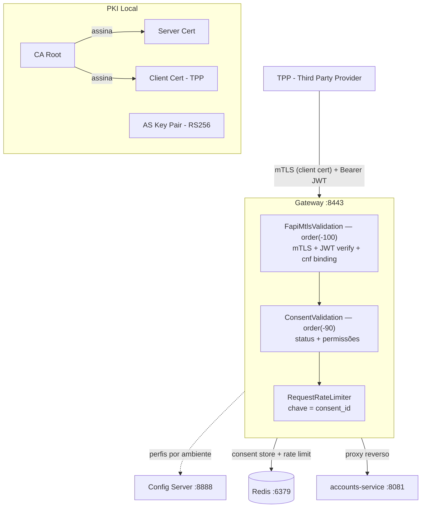

# Open Finance

API Gateway que implementa os requisitos de segurança do Open Finance Brasil (FAPI 1.0 Advanced) —
mTLS, certificate-bound access tokens (RFC 8705), validação de consentimentos e rate limiting por
consent_id.

[](https://github.com/mcoldibelli/open-finance/actions/workflows/ci.yml)
[](https://github.com/mcoldibelli/open-finance/actions/workflows/cd.yml)


---

## Arquitetura



O Gateway é o único ponto de entrada. Nenhum serviço interno aceita tráfego externo. O TPP (
instituição participante do Open Finance) precisa apresentar certificado de cliente via mTLS e um
JWT assinado pelo Authorization Server para que a request passe pela cadeia de filtros.

---

## Stack e justificativas

| Tecnologia               | Papel                         | Por que essa escolha                                                                                                 |
|--------------------------|-------------------------------|----------------------------------------------------------------------------------------------------------------------|
| **Java 21**              | Runtime                       | Records para modelos imutáveis, LTS                                                                                  |
| **Spring Cloud Gateway** | API Gateway                   | Reativo (Project Reactor), integração nativa com filtros ordenados e `SslInfo` para acesso ao certificado do cliente |
| **Spring Cloud Config**  | Configuração centralizada     | Perfis por ambiente (`local`, `docker`), sem rebuild — rotas e rate limits podem mudar sem redeploy                  |
| **Redis**                | Rate limiting + consent store | TTL nativo para expiração de consentimentos, operações atômicas via Lua script, Lettuce (non-blocking)               |
| **Nimbus JOSE+JWT**      | Processamento JWT             | Implementação de referência para JOSE/JWT, suporte a RS256 e claims customizadas (`cnf`, `consent_id`)               |
| **Docker**               | Containerização               | Multi-stage build (JDK → JRE), imagem Alpine, usuário non-root                                                       |
| **GitHub Actions**       | CI/CD                         | Geração dinâmica de certificados no CI, push para GHCR, pipeline staging -> prod                                     |

---

## Decisões de design

### Por que mTLS vem antes do rate limiting

Os filtros do Gateway executam por ordem definida via `getOrder()`:

| Filtro                     | Order   | Responsabilidade                                           |
|----------------------------|---------|------------------------------------------------------------|
| `FapiMtlsValidationFilter` | -100    | Identidade: valida certificado + JWT + cnf binding         |
| `ConsentValidationFilter`  | -90     | Autorização: verifica status e permissões do consentimento |
| `RequestRateLimiter`       | default | Throttling: limita requests por `consent_id`               |

A ordem importa: se o rate limiter rodasse primeiro, um atacante sem certificado consumiria a cota
de rate limit de outros TPPs. Autenticação deve sempre preceder controle de tráfego. Além disso, o
`consent_id` usado como chave do rate limiter só existe após o `FapiMtlsValidationFilter` extraí-lo
do JWT e injetá-lo no header `X-Consent-ID`.

### cnf binding (RFC 8705) — o ataque que previne

Sem certificate-bound tokens, um JWT roubado pode ser usado por qualquer cliente. O cnf binding
resolve isso:

1. O Authorization Server gera o JWT com a claim `cnf.x5t#S256` = SHA-256 do certificado do TPP
2. O Gateway computa o SHA-256 do certificado apresentado via mTLS (
   `CertificateThumbprint.computeS256`)
3. Se o thumbprint do JWT for diferente do thumbprint do certificado, a request é rejeitada

Isso garante que um token só funciona com o certificado que o originou. Mesmo com o JWT vazado, um
atacante não consegue replicar o certificado TLS do TPP.

### Config Server vs application.yml local — o que vai em cada um

```
application.yml (local)          Config Server (gateway-service.yml)
├── spring.config.import         ├── server.port
├── server.ssl.*                 ├── spring.data.redis.*
│   ├── key-store                ├── spring.cloud.gateway.routes
│   ├── trust-store              ├── gateway.rate-limit.*
│   └── client-auth: need        └── jwt.issuer / jwt.audience
└── spring.cloud.config.retry
```

**Regra**: o SSL vai no `application.yml` local porque o servidor precisa do keystore/truststore
para iniciar o listener TLS **antes** de conectar ao Config Server. Se o SSL dependesse do Config
Server, o Gateway não conseguiria sequer fazer a request HTTP para buscar a config.

Rotas, Redis e rate limits vão no Config Server porque podem mudar entre ambientes (local vs Docker
vs prod) sem rebuild.

### `optional:configserver:` vs `fail-fast`

```yaml
spring:
  config:
    import: "optional:configserver:${CONFIG_SERVER_URI:http://localhost:8888}"
  cloud:
    config:
      fail-fast: true
      retry:
        max-attempts: 3
```

Parece contraditório, mas resolve cenários distintos:

- **`optional:`** — permite o Gateway subir sem Config Server (ex: rodar testes locais, IDE). Cai no
  config local.
- **`fail-fast: true` + retry** — quando o Config Server está configurado mas temporariamente
  indisponível (ex: startup no Docker Compose), ele tenta 3x antes de falhar.

Em produção, o correto é remover `optional:` e manter `fail-fast: true` para garantir que o Gateway
nunca suba com config stale.

### `onErrorMap` antes do `flatMap`

```java
jwtVerifier.verify(token.get())
    .onErrorMap(SecurityException .class, e -> e)                    // mantém SecurityException
    .onErrorMap(Exception .class, e -> new SecurityException(...))  // encapsula o resto
    .flatMap(claims -> processValidatedClaims(...))
    .onErrorResume(SecurityException .class, e -> reject(...));
```

Sem o `onErrorMap`, uma `ParseException` do Nimbus propagaria pelo pipeline reativo como erro
genérico. O `onErrorResume` no final só captura `SecurityException` — qualquer outra exceção vazaria
como 500 para o cliente, potencialmente expondo detalhes internos (stack trace, versão da lib).

O `onErrorMap` garante que **todo erro de JWT vira `SecurityException` antes de entrar no `flatMap`
**, isolando a camada de validação da camada de processamento.

### Por que o AS assina o JWT e não o TPP

No modelo FAPI (e OAuth 2.0 em geral), o fluxo é:

1. TPP se autentica no Authorization Server via mTLS
2. AS valida o consentimento e emite um JWT **assinado com a chave privada do AS**
3. Gateway valida a assinatura com a **chave pública do AS** (`as-public.pem`)

Se o TPP assinasse o JWT, não haveria como garantir que ele não forjou claims (`consent_id`, `cpf`,
permissões). O AS é a única entidade que pode atestar que o consentimento existe e está autorizado.

Por isso o `JwtVerifier` carrega a chave pública do AS no `@PostConstruct` e verifica issuer,
audience e expiração, qualquer JWT não assinado pelo AS é rejeitado.

### `Mono.defer()` no `reject()`

```java
private Mono<Void> reject(ServerWebExchange exchange, String reason) {
  return Mono.defer(() -> {
    exchange.getResponse().setStatusCode(HttpStatus.UNAUTHORIZED);
    exchange.getResponse().getHeaders().add("X-Rejection-Reason", reason);
    return exchange.getResponse().setComplete();
  });
}
```

Sem `Mono.defer()`, o `setStatusCode` e `addHeader` seriam executados **no momento da montagem do
pipeline**, não na subscrição. Em um pipeline reativo, métodos que retornam `Mono<Void>` podem ser
compostos mas nunca subscritos (ex: quando outro operador curto-circuita antes). O `defer()` garante
que os side-effects só ocorrem quando o `Mono` é de fato executado.

### Usuário non-root nos Dockerfiles

```dockerfile
RUN addgroup -S spring && adduser -S spring -G spring
USER spring
```

Todo Dockerfile cria um usuário `spring` e roda o processo Java como esse usuário. Se um atacante
explorar uma vulnerabilidade na aplicação (ex: RCE via desserialização), ele terá permissões
limitadas dentro do container — sem acesso a `/etc/shadow`, sem capacidade de montar volumes, sem
escalar para o host.

---

## Como rodar localmente

### Pré-requisitos

- Java 21
- Docker e Docker Compose
- OpenSSL
- keytool

### 1. Gerar PKI local

```bash
mkdir -p certs && cd certs

# CA root
openssl genrsa -out ca.key 2048
openssl req -new -x509 -days 365 -key ca.key -out ca.crt \
  -subj "/CN=Open Finance CA/O=Codaline/C=BR"

# Certificado do servidor (Gateway)
openssl genrsa -out server.key 2048
openssl req -new -key server.key -out server.csr \
  -subj "/CN=localhost/O=Codaline/C=BR"
openssl x509 -req -days 365 -in server.csr \
  -CA ca.crt -CAkey ca.key -CAcreateserial -out server.crt
openssl pkcs12 -export -in server.crt -inkey server.key \
  -out server.p12 -name gateway -passout pass:gateway123

# Certificado do cliente (TPP simulado)
openssl genrsa -out client.key 2048
openssl req -new -key client.key -out client.csr \
  -subj "/CN=tpp-simulado/O=TPP/C=BR"
openssl x509 -req -days 365 -in client.csr \
  -CA ca.crt -CAkey ca.key -CAcreateserial -out client.crt
openssl pkcs12 -export -in client.crt -inkey client.key \
  -out client.p12 -name tpp-simulado -passout pass:client123

# Truststore (contém o CA)
keytool -import -file ca.crt -alias ca-root \
  -keystore truststore.p12 -storetype PKCS12 \
  -storepass truststore123 -noprompt

# Par de chaves do Authorization Server
openssl genrsa -out as-private.key 2048
openssl rsa -in as-private.key -pubout -out as-public.pem

# Copiar chave pública para o classpath do Gateway
cp as-public.pem ../gateway-service/src/main/resources/
```

### 2. Configurar `.env`

```dotenv
REDIS_PASSWORD=openfinance123
SSL_KEYSTORE_PASSWORD=gateway123
SSL_TRUSTSTORE_PASSWORD=truststore123
SSL_KEYSTORE_PATH=/absolute/path/to/certs/server.p12
SSL_TRUSTSTORE_PATH=/absolute/path/to/certs/truststore.p12
CERTS_DIR=/absolute/path/to/certs
CONFIG_SERVER_URI=http://config-server:8888
```

### 3. Subir os serviços

```bash
docker compose up --build
```

### 4. Testar a cadeia de segurança

```bash
# Teste 1 — Sem certificado de cliente (TLS handshake falha)
curl -v --cacert certs/ca.crt \
  https://localhost:8080/open-banking/accounts/v2
# Esperado: SSL handshake error — server exige client-auth: need

# Teste 2 — Com certificado mas sem Bearer token (401)
curl --cacert certs/ca.crt \
  --cert certs/client.crt --key certs/client.key \
  https://localhost:8080/open-banking/accounts/v2
# Esperado: 401 + header X-Rejection-Reason: "Bearer token required"

# Teste 3 — Cadeia completa: cert + JWT válido
# (Requer gerar JWT com GenerateTestJwt e seed de consentimento no Redis)
export CERTS_DIR=/absolute/path/to/certs
java -cp gateway-service/target/classes br.com.codaline.gateway.GenerateTestJwt

# Seed do consentimento no Redis:
redis-cli -a openfinance123 HSET consent:consent-teste-001 \
  consent_id consent-teste-001 \
  status AUTHORISED \
  permissions ACCOUNTS_READ,ACCOUNTS_BALANCES_READ \
  cpf 12345678900 \
  client_id tpp-simulado

curl --cacert certs/ca.crt \
  --cert certs/client.crt --key certs/client.key \
  -H "Authorization: Bearer <jwt-gerado-acima>" \
  https://localhost:8080/open-banking/accounts/v2
# Esperado: 200 + payload de contas
```

---

## Testes

```bash
# Rodar com certificados gerados
export CERTS_DIR=/absolute/path/to/certs
./mvnw verify
```

### O que cada teste valida

| Teste                                               | Cenário                                      | Resposta esperada                        |
|-----------------------------------------------------|----------------------------------------------|------------------------------------------|
| `semToken_deveRetornar401`                          | Request sem header Authorization             | 401 + `X-Rejection-Reason`               |
| `comTokenSemCnf_deveRetornar401`                    | JWT válido mas sem claim `cnf.x5t#S256`      | 401 — cnf binding falha                  |
| `comTokenValido_consentimentoAutorizado_devePassar` | JWT + consent AUTHORISED + permissão correta | 200 (ou 502 se accounts-service offline) |
| `semPermissaoTransacoes_deveRetornar403`            | Consent sem `ACCOUNTS_TRANSACTIONS_READ`     | 403 — permissão negada                   |
| `consentimentoInexistente_deveRetornar401`          | consent_id que não existe no Redis           | 401 — consent not found                  |

### Por que `CERTS_DIR` em vez de paths hardcoded

Os testes leem certificados de `System.getenv("CERTS_DIR")`. Isso resolve dois problemas:

1. **Portabilidade** — no CI, os certificados são gerados em `/tmp/certs`. Na máquina do dev, ficam
   em qualquer diretório. Hardcodar o path quebraria um dos dois.
2. **Segurança** — chaves privadas (`as-private.key`, `client.key`) nunca são commitadas. O
   `.gitignore` bloqueia `*.pem`, `*.key`, `*.p12`. O teste precisa de um path externo para
   encontrá-las.

Os testes desabilitam SSL e Config Server via `@TestPropertySource` para rodar isoladamente com
`WebTestClient`, validando apenas a lógica dos filtros FAPI.

---

## Pipeline CI/CD

```
push (qualquer branch)
  └─ CI: build + testes
       ├─ Gera certificados dinâmicos (openssl)
       ├─ Copia as-public.pem para o classpath
       ├─ Sobe Redis como service container
       └─ ./mvnw verify

push (main)
  └─ CD: build images + deploy
       ├─ Build multi-stage (Dockerfile por módulo)
       ├─ Push para GHCR (ghcr.io/mcoldibelli/open-finance/*)
       │   ├─ config-server:latest + :sha
       │   ├─ gateway-service:latest + :sha
       │   └─ accounts-service:latest + :sha
       ├─ Deploy staging (environment gate)
       └─ Deploy production
```

### Certificados dinâmicos no CI

O CI gera uma PKI completa em cada execução — CA, server cert, client cert e AS key pair. Isso
garante que os testes nunca dependem de certificados commitados ou secrets com material
criptográfico. A chave pública do AS é copiada para o classpath antes do build para que o
`JwtVerifier` consiga carregá-la via `@Value("classpath:as-public.pem")`.

---